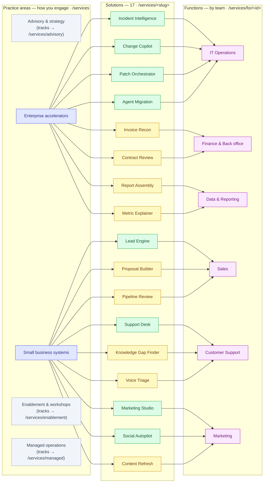
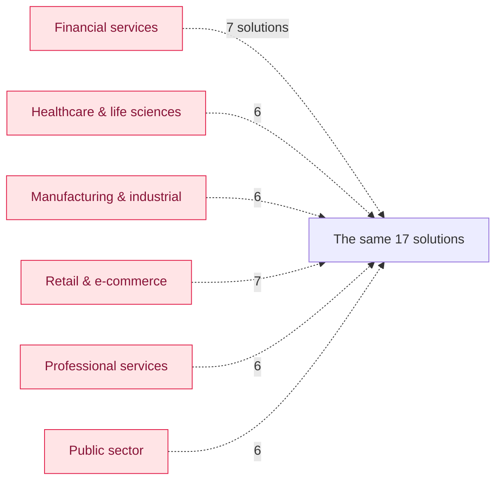
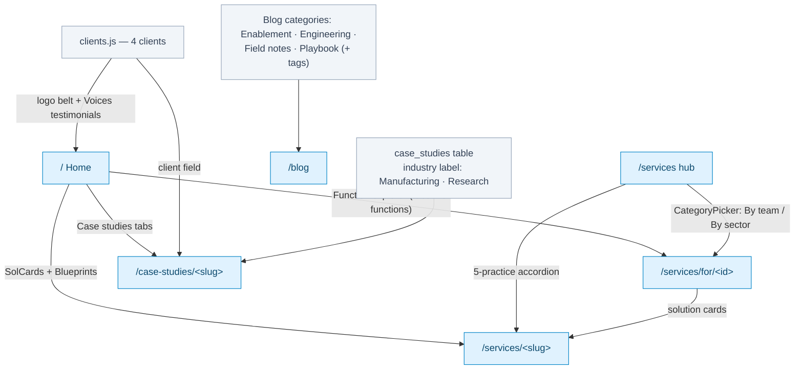

# Content taxonomy — how the categories link together

How the site's category systems relate, mapped from the data files. Three axes lead into the
same 17 solutions — **practice area** (`parent`), **function** (`fn`, exactly one per
solution), and **industry** (curated many-to-many) — plus a **status** axis (production vs
scoped). Sources: [`src/data/capabilities.js`](src/data/capabilities.js),
[`src/data/functions.js`](src/data/functions.js), [`src/data/clients.js`](src/data/clients.js),
the `case_studies` table.

## 1. The catalogue: practice areas × solutions × functions

**Legend:** green = `status: 'production'` (badge "Accelerator", 8 of 17) · yellow =
`status: 'scope'` ("Built to scope", 9) · grey = practices that hold people-work *tracks*
rather than solutions. Every solution has **exactly one** parent and **exactly one** function
(`byParent()` / `byFunction()` in `capabilities.js`).

## 2. Industries — the third lens (curated many-to-many)

Industries do not own solutions; each hand-picks from the same catalogue. `functions.js` is
explicit about why: *"Nothing sector-specific has been invented to fill a grid."*

Functions **and** industries resolve through the same route — `/services/for/<id>` — with the
entry's `kind` deciding the "By team" / "By sector" framing on the page.

## 3. How the surfaces wire into these categories

## Observations

1. **The two solution-owning practices split by buyer, not by technology.** `accelerators` is
   the enterprise book (IT operations plus finance/data back office); `small-business` is the
   revenue side (sales, support, marketing). The other three practices sell people, not
   systems.
2. **The status axis maps the delivery record.** All four IT Operations solutions are
   `production`; every finance and data solution is `scope`. The badge distribution shows
   exactly where the firm has actually run.
3. **One loose thread.** `case_studies.industry` is a free-text label (`Manufacturing`,
   `Research`) with no link to the industries taxonomy — `Research` has no corresponding
   sector page at all. If case studies should ever surface on industry pages, that column
   needs to reference `industries[].id` instead of holding prose.
